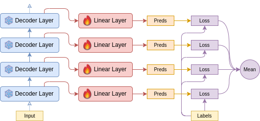

# Small Model Is All You Need

Welcome to the official repository for the NTU SC4001 Neural Network & Deep Learning project report _"Small Model Is All You Need"_. This repository contains all the code and resources required to replicate the findings and experiments presented in the report.

<p align='center'>
  
</p>

<p align="center">
    <a href="https://github.com/ztjhz/miniLM/blob/main/public/Report.pdf">Project Report</a>
    |
    <a href="https://wandb.ai/sc4001/text-sentiment-analysis/">W&B Runs</a>
    |
    <a href="https://api.wandb.ai/links/sc4001/vz711n0m">W&B Graphs</a>
</p>

The rise of large language models (LLMs) such as GPT-3 and its successors has heralded a new era in natural language processing (NLP), offering unprecedented capabilities across a wide spectrum of tasks. However, the universal application of these computational giants for all NLP tasks has been questioned, particularly when more straightforward tasks may not necessitate the heft and complexity of LLMs.

This report investigates the performance of large and small language models on sentiment analysis tasks, aiming to ascertain whether such tasks genuinely benefit from the scale of LLMs:

<p align='center'>
  
</p>

- Through a novel slicing technique applied to the Llama model, we reveal that not all layers contribute equally, with middle layers often outperforming others.
- We extend our analysis to RoBERTa, contrasting the effectiveness of pretraining against fine-tuning on smaller datasets such as IMDb.
- Additionally, we fine-tune smaller models like RoBERTa, GPT-2, and T5, which demonstrate results comparable with LLMs across several benchmarks, including IMDb, SST-2, and Yelp datasets.
- We also did a further analysis on slicing RoBERTa and discovered that RoBERTa's capabilities is best realized through fine-tuning across all layers due to its less capable zero-shot abilities.

Our findings advocate for a more nuanced selection of language models, demonstrating that smaller models can be equally adept as LLMs for certain applications, thus providing a more cost-effective and resource-efficient alternative. This project aims to guide companies and startups in choosing the right model for the right task, highlighting that while LLMs hold substantial value, they are not a one-size-fits-all solution in the realm of AI-driven language tasks.

- [Environment Setup](#environment-setup)
  - [Setting Up a Python Virtual Environment (Optional)](#setting-up-a-python-virtual-environment-optional)
  - [Installing Dependencies](#installing-dependencies)
- [Training](#training)
  - [Training Scripts](#training-scripts)
  - [Selecting a GPU Device](#selecting-a-gpu-device)
  - [Script Options](#script-options)
  - [Handling CUDA Out of Memory Errors](#handling-cuda-out-of-memory-errors)
- [Authors](#authors)
- [Project Report](#project-report)

## Environment Setup

Before you begin, make sure your development environment is set up correctly.

### Setting Up a Python Virtual Environment (Optional)

It's a good practice to create a virtual environment to manage dependencies for your project. To set up a Python virtual environment, run:

```sh
python3 -m venv .venv
source .venv/bin/activate
```

### Installing Dependencies

Install all required packages using `pip`:

```sh
pip install -r requirements.txt
```

You will also need to install PyTorch. Follow the instructions specific to your platform at [PyTorch Get Started](https://pytorch.org/get-started/locally/).

## Training

Our project leverages [DeepSpeed](https://github.com/microsoft/DeepSpeed) to optimize training on GPU. As such, we currently only support training on GPU-enabled setups.

### Training Scripts

Training scripts are provided in the `/scripts` directory. To start training:

1. Navigate to the base directory of the project.
2. Run the appropriate script for your training needs.

**Example Commands:**

- To run the Sliced Llama training:

  ```sh
  sh scripts/llama.sh
  ```

- To run the Comparing Transformers training:
  ```sh
  sh scripts/compare_transformers.sh
  ```

### Selecting a GPU Device

You can specify the GPU device(s) to use with the `--include` flag followed by the device IDs.

Example: `--include localhost:2,3` will use GPU devices 2 and 3.

### Script Options

Below are the options available in various scripts:

**Comparing Transformers Script Options:**

```sh
--dataset        Choose from 'imdb', 'yelp', 'sst2'. Default is 'imdb'.
--model          Choose from 'roberta', 'gpt2', 't5'. Default is 'roberta'.
--subset_yelp    Subset the Yelp dataset to reduce training time. Default is False.
```

**Small Dataset Script Options:**

```sh
--init       'train' to start training from scratch, 'finetune' to start from pre-trained weights.
--model      The model to use. Default is 'roberta'.
--run_name   The run name for the Weights & Biases experiment.
```

**Llama Script Options:**

```sh
--dataset    Choose from 'imdb', 'yelp'. Default is 'imdb'.
```

### Handling CUDA Out of Memory Errors

If you encounter a CUDA out of memory error during training, try adjusting the `allgather_bucket_size` and `reduce_bucket_size` parameters in the `ds_config.json` file.

## Authors

<a href='https://github.com/ztjhz' title='Toh Jing Hua'> </a>
<a href='https://github.com/xJQx' title='Toh Jing Qiang'> </a>
<a href='https://github.com/Lebarnon' title='Lenson Lim'> </a>

## Project Report

For a comprehensive understanding of our project, methodologies, and detailed results, please refer to our project report. You can access the report at the following link: [Project Report - Small Model Is All You Need](https://github.com/ztjhz/miniLM/blob/main/public/Report.pdf)
